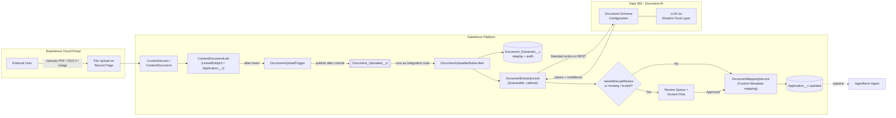
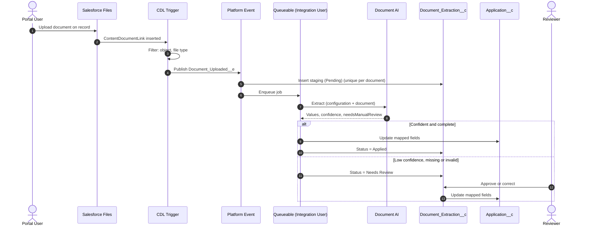

# Automating Document Data Entry with Salesforce Document AI

### Extract data from files uploaded on an Experience Cloud portal and populate Salesforce records, with confidence-based human review

**Author:** [Your Name] · Salesforce Architect · [LinkedIn](https://www.linkedin.com/in/your-profile)
**Stack:** Data 360 (Data Cloud) Document AI · Agentforce · Experience Cloud · Apex · Platform Events · Flow

---

## At a Glance

| | |
|---|---|
| **Problem** | Portal users upload application forms, certificates and invoices. Staff re-key the data into Salesforce by hand. |
| **Solution** | Document AI extracts the values with an LLM, using a schema you define. Automation maps them onto the record, and anything below a confidence threshold goes to a reviewer. |
| **Key patterns** | Platform Event handoff to an integration user · staging and audit object · metadata-driven field mapping · pluggable extraction client (Flow action or REST) · idempotent processing |
| **Files in this gist** | This guide, 7 Apex files (triggers, classes, test) and 1 metadata file. See [Files in This Gist](#14-files-in-this-gist). |

---

## Contents

1. [The Problem](#1-the-problem)
2. [Choosing the Right Salesforce Capability](#2-choosing-the-right-salesforce-capability)
3. [Prerequisites](#3-prerequisites)
4. [Supported File Types](#4-supported-file-types)
5. [Architecture](#5-architecture)
6. [Key Design Decisions](#6-key-design-decisions)
7. [Implementation, Step by Step](#7-implementation-step-by-step)
8. [Reading the Extraction Output](#8-reading-the-extraction-output)
9. [Human-in-the-Loop Review](#9-human-in-the-loop-review)
10. [Security](#10-security)
11. [Gotchas and Lessons Learned](#11-gotchas-and-lessons-learned)
12. [Testing and Rollout](#12-testing-and-rollout)
13. [Extending with Agentforce](#13-extending-with-agentforce)
14. [Files in This Gist](#14-files-in-this-gist)
15. [References](#15-references)

---

## 1. The Problem

External users (applicants, customers, partners) upload supporting documents on an **Experience Cloud** site against a record, for example an `Application__c`. An internal team then opens every file and types the values into fields.

**Requirements**

1. Extract defined values from PDF, Word and image files automatically.
2. Populate the fields on the related record.
3. Never write low-confidence data silently. Route it to a human.
4. Keep an audit trail of the file, the configuration used, the raw output and the confidence.
5. Make field mappings maintainable by admins, without code changes.

| Document field | Target field (example) |
|---|---|
| Applicant Name | `Application__c.Applicant_Name__c` |
| Date of Birth | `Application__c.Date_of_Birth__c` |
| Registration Number | `Application__c.Registration_Number__c` |
| Issue Date | `Application__c.Certificate_Issue_Date__c` |

> `Application__c` is a placeholder. Swap in your own object.

---

## 2. Choosing the Right Salesforce Capability

Three Salesforce options come up for this requirement. Only one of them is built for it.

| Capability | Built for | Verdict |
|---|---|---|
| **Agentforce Data Library** | **Retrieval (RAG).** It chunks and vector-indexes content so agents can *answer questions* about documents. | ❌ It doesn't put values into fields. Files must be explicitly added to the library, and uploads are limited to text, HTML and PDF. |
| **Intelligent Document Automation / Intelligent Form Reader** | Document intake workspaces in industry clouds (Health Cloud, Public Sector), powered by **Amazon Textract**. | ⚠️ Only available in those clouds, and it needs a separate Textract licence. |
| **Data 360 Document AI** | **Extraction.** You define a schema, an LLM extracts the values, and you get a confidence score per field. It can read files already in Salesforce Files. | ✅ Chosen. |

A common first instinct is: "we're getting Agentforce, so let's use the Data Library". The distinction to remember is **retrieval versus extraction**. The Data Library helps an agent *talk about* a document. Document AI turns the document *into data*.

---

## 3. Prerequisites

### 3.1 Licences and Features

| Requirement | Why |
|---|---|
| **Data 360 licence** | Document AI runs on Data 360. It is **not** available with Customer Data Platform (CDP) licences. |
| **Einstein Generative AI** turned on | Document AI uses LLMs. |
| **Agentforce** enabled | Required to use Document AI. |
| **Flex Credits / Data 360 credits** | Each extraction consumes credits. Forecast documents × pages. |
| **Document Processing** org permission | Enables the extraction capability. |
| **MuleSoft for Flow: IDP add-on**, or Agentforce 1 Editions | Needed **only** if you use the standard *Extract Data from Document* action. It is licensed **per user**. |
| **Experience Cloud** | Authenticated portal users who can access the target record. |

> **Licensing decides the invocation path.** There are two ways to call Document AI (section 6, decision 5). Confirm with your Salesforce account team which one your contract covers **before** you build.

### 3.2 Permissions

| Persona | Access |
|---|---|
| **Integration user** (runs all extractions) | Document Processing permission, Data 360 access, Read on ContentVersion, and Edit on the target object and staging object. Holds the IDP add-on if you use the standard action. |
| **Admin** | Data 360 permissions to build Document AI configurations. |
| **Reviewers** | Staging object, review queue, target record and source file. |
| **Portal users** | Upload files on their own records only. **No** Document AI access. |

### 3.3 REST Path Only

- An **External Client App** (the replacement for Connected Apps) for OAuth.
- A **Named Credential** backed by an **External Credential** using OAuth 2.0 Client Credentials, pointing at your own org's My Domain.

---

## 4. Supported File Types

| Format | Extension | MIME type |
|---|---|---|
| PDF | `.pdf` | `application/pdf` |
| Images | `.png`, `.jpeg`/`.jpg` | `image/png`, `image/jpeg` |
| Word | `.docx` | `application/vnd.openxmlformats-officedocument.wordprocessingml.document` |
| PowerPoint | `.pptx` | `application/vnd.openxmlformats-officedocument.presentationml.presentation` |
| Excel (single sheet) | `.xlsx` | `application/vnd.openxmlformats-officedocument.spreadsheetml.sheet` |

Legacy `.doc` files, multi-sheet workbooks and password-protected files aren't supported. Block them at upload.

> **Word through the standard action:** Document AI supports `.docx`. However, the action's Base64 `mimeType` input documents only PDF and image types. When you use the standard action, pass the `contentDocumentId` and include `.docx` samples in your acceptance tests. Otherwise, use the REST path.

---

## 5. Architecture

### 5.1 Components



### 5.2 Runtime Sequence



---

## 6. Key Design Decisions

**1. Hand off to an integration user through a Platform Event.**
The upload runs in the *portal user's* context, and asynchronous Apex runs as the user who enqueued it. Enqueuing extraction straight from the trigger would therefore require every external user to hold Document AI permissions and add-on licences. Instead, the trigger publishes `Document_Uploaded__e`, and a **`PlatformEventSubscriberConfig`** runs the subscriber as a single integration user. Permissions stay least-privilege, and licensing is limited to one user.

**2. Use a staging object instead of writing straight to the record.**
`Document_Extraction__c` stores the raw JSON, flags, status and errors. It gives you an audit trail, a review surface, a retry mechanism and an operations dashboard, and it separates "what the AI said" from "what we committed".

**3. Enforce idempotency with a unique External ID.**
`Content_Document_Id__c` is unique. When the same file is shared to another record, or an event is redelivered, the second insert fails quietly and no credits are spent twice.

**4. Process one document per Queueable.**
File size, heap and callout limits vary per document. Isolating each document keeps failures contained and resource use predictable.

**5. Make the extraction client pluggable.**
`DocumentAIClients.Client` has two implementations:
- `StandardActionClient`: the `extractDataFromDocument` standard action, which needs the IDP add-on or Agentforce 1.
- `RestApiClient`: the Data 360 endpoint `/ssot/document-processing/actions/extract-data` through a Named Credential.

A Custom Metadata switch selects the client, so licensing changes don't require code changes, and tests can inject a stub.

**6. Drive field mapping with metadata.**
`Document_Field_Mapping__mdt` maps each extracted field to an object field, with a type and a required flag. Admins add fields without a deployment of code.

**7. Review only on confidence, completeness and type safety.**
A record is auto-applied only when Document AI reports no low-confidence fields, every required field is present, and every value converts cleanly to its target type. Anything else goes to a human.

---

## 7. Implementation, Step by Step

### Step 1: Enable the Platform

1. Confirm the Data 360 licence and complete Data 360 setup.
2. Turn on **Einstein Generative AI** and enable **Agentforce**.
3. Have Salesforce enable the **Document Processing** org permission.
4. For the standard-action path, confirm that the MuleSoft for Flow: IDP add-on or Agentforce 1 is provisioned.

### Step 2: Create the Integration User

1. Create the user `document.ai@yourco.com`.
2. Create a permission set **`Document_AI_Processing`** containing Document Processing, Data 360 access, Read on Files, Edit on `Application__c`, and full access to `Document_Extraction__c`.
3. Assign the IDP add-on licence to this user if you use the standard action.

### Step 3: Build the Document AI Configuration

In **Data 360 → Document AI**, create **one configuration per document type**. Build it without a source object, because real-time (transactional) mode doesn't need Unstructured Data Model Objects.

1. Choose the document type and the LLM.
2. Upload **3–5 representative samples**, including a poor scan and a layout variant.
3. Define the fields with **auto-extraction** (then prune) or **manually**. Write a short description for each field. Descriptions are the main lever for improving accuracy.
4. Set a **confidence threshold** on each field. Start around 80 for critical fields.
5. Test, refine, then **publish** with a stable API name, for example `Application_Form_Extraction`.

### Step 4: Create the Data Model

**`Document_Extraction__c`** (Private OWD, no portal access)

| Field | Type | Notes |
|---|---|---|
| `Target_Record_Id__c` | Text(18) | Record the file is attached to |
| `Content_Document_Id__c` | Text(18) · **Unique · External ID** | Idempotency key |
| `Content_Version_Id__c` | Text(18) | Exact version processed |
| `Configuration_Name__c` | Text(255) | Document AI configuration API name |
| `Status__c` | Picklist | `Pending`, `Extracted`, `Needs Review`, `Applied`, `Failed` |
| `Needs_Manual_Review__c` | Checkbox | |
| `Extracted_Data_JSON__c` | Long Text (131,072) | Raw output, for audit |
| `Error_Message__c` | Long Text | |
| `Attempts__c` | Number | Retry counter |

**`Document_Field_Mapping__mdt`**: `Configuration_Name__c`, `Extracted_Field_Name__c`, `Target_Field__c`, `Data_Type__c` (Text / Date / Number / Currency / Checkbox), `Required__c`.

**`Document_AI_Setting__mdt`** (one record, `Default`): `Use_REST_API__c` (Checkbox), `Named_Credential__c`, `API_Version__c`, `Default_Configuration__c`.

**`Document_Uploaded__e`**: `Target_Record_Id__c`, `Content_Document_Id__c`, `Content_Version_Id__c`, `Configuration_Name__c`. Set Publish Behavior to **Publish After Commit**.

### Step 5: Configure the Portal Upload

Add **Related Files**, or a custom LWC that uses `lightning-file-upload` with `record-id`, to the record page in Experience Builder. Restrict formats to `.pdf, .docx, .png, .jpg, .jpeg` and set a file size limit. Uploading on the record creates a `ContentDocumentLink` to that record, and that link is the trigger point.

### Step 6: Deploy the Automation

| Order | File | Role |
|---|---|---|
| 1 | `DocumentUploadTrigger.trigger` + `DocumentUploadHandler.cls` | Detect relevant uploads and publish the event |
| 2 | `DocumentUploadedSubscriber.trigger` | Create the staging record and enqueue the job, as the integration user |
| 3 | `DocumentUploadedSubscriberConfig.platformEventSubscriberConfig-meta.xml` | Sets the subscriber's **running user** |
| 4 | `DocumentAIClients.cls` | Pluggable extraction client (standard action or REST) |
| 5 | `DocumentExtractionJob.cls` | Callout first, then DML; handles errors and retries |
| 6 | `DocumentMappingService.cls` | Maps, type-converts, and decides whether to apply or review |
| 7 | `DocumentExtractionTest.cls` | End-to-end test with a stubbed client |

### Step 7: Low-Code Alternative (Flow)

Teams that prefer Flow can keep the trigger and subscriber in Apex, and have the job start an **autolaunched Flow**:

**Get Records** (staging) → **Action: Extract Data from Document** (*Content Document ID*, *Document Processing Configuration*) → **Decision** on `needsManualReview` → **Update Records** (target) → **Update Records** (staging status) → **Fault path** (status `Failed`).

The action's *Extracted Data* output is an Apex-defined type generated from your configuration, so its fields are directly usable in Flow.

---

## 8. Reading the Extraction Output

The standard action returns these outputs:

| Output | Meaning |
|---|---|
| `extractedData` | Object with one entry per configured field: `value` plus confidence metadata |
| `extractedDataJson` | The same data as a JSON string. **This is what we store and parse.** |
| `needsManualReview` | `true` if **any** field scored below its threshold |
| `contentDocumentId`, `documentProcessingConfigurationId` | Traceability |

Example `extractedDataJson`:

```json
{
  "applicant name":      { "type": "string", "value": "Jane Doe",  "confidence_score": 0.98, "confidence_threshold": 80.0 },
  "registration number": { "type": "string", "value": "RX-20931", "confidence_score": 0.71, "confidence_threshold": 80.0 },
  "needsManualReview":   { "type": "boolean", "value": true }
}
```

Three details trip people up:

- **Mixed scales.** In the JSON string, `confidence_score` runs from **0 to 1** while `confidence_threshold` runs from **0 to 100**. In the `extractedData` object, scores are integers from 0 to 100.
- **Hex-encoded keys.** In the `extractedData` object, a space becomes `x20` and an underscore becomes `x5f` (for example, `registrationx20number`). The JSON string keeps the plain names, which is another reason to parse the JSON.
- **`needsManualReview` is injected** as a pseudo-field alongside your real fields. Skip it when mapping.

---

## 9. Human-in-the-Loop Review

A staging record moves to `Needs Review` when Document AI flags low confidence, a required value is missing, or a value can't be converted to the target type. Reviewers work from a **queue list view** and a **Screen Flow** that shows:

- a **File Preview** of the source document;
- each extracted value with its confidence score, next to the current record value;
- editable inputs for each correction, then **Approve** → apply to the record → `Applied`.

Keep the corrections. Recurring corrections on the same field are the signal to improve that field's description or threshold in the configuration.

---

## 10. Security

- **Least privilege:** portal users only upload. Every Document AI call runs as the integration user.
- **Staging data is private:** `Document_Extraction__c` uses a Private OWD and is not exposed to the portal. Consider Shield Platform Encryption for `Extracted_Data_JSON__c` when documents contain PII.
- **Trust Layer:** extraction runs through Salesforce's LLM stack. Get the chosen model approved against your data-residency and retention requirements.
- **Credentials:** the REST path uses an External Credential with Client Credentials. There are no tokens in code.
- **Scope:** this design assumes **authenticated** portal users. Unauthenticated guest uploads need a separate threat review.

---

## 11. Gotchas and Lessons Learned

| # | Gotcha | How it's handled |
|---|---|---|
| 1 | Picking the **Data Library** because "we have Agentforce" | It's retrieval, not extraction. Use Document AI. |
| 2 | The standard action needs the **MuleSoft for Flow: IDP add-on, per user** | Licence one integration user, or use the REST client. |
| 3 | Async jobs run as the **portal user** | Platform Event plus `PlatformEventSubscriberConfig` running user |
| 4 | **"You have uncommitted work pending"** | The job performs the callout **before** any DML. The staging record is created earlier, in the subscriber transaction. |
| 5 | Base64 adds **~33%** to the payload (REST path) | One document per job (async heap is 12 MB), plus a portal upload size limit |
| 6 | The same file linked to **several records** fires the trigger again | Unique `Content_Document_Id__c`, inserted with `allOrNone = false` |
| 7 | Portal users **can't query** the staging object | The duplicate check happens in the subscriber, which runs as the integration user |
| 8 | Confidence **scales differ** (0–1 versus 0–100) | Rely on `needsManualReview` and don't recompute thresholds |
| 9 | **Hex-encoded keys** in `extractedData` | Parse `extractedDataJson` instead |
| 10 | **Date formats** vary between documents | Try ISO first, then locale parsing, else send to review |
| 11 | Credits are spent on **every** call | Idempotency, file-type filtering and a retry cap (3) |
| 12 | A **new version** of a file isn't re-extracted | By design. To re-extract, key the staging record on `Content_Version_Id__c` and trigger on ContentVersion. |

---

## 12. Testing and Rollout

**Accuracy pilot**

1. Collect **20–50 real, anonymised documents** per type, including poor scans and layout variants.
2. Score each field as **correct / wrong / missing**, and record the review rate at each threshold.
3. Tune field descriptions first and thresholds second. Re-run the pilot.
4. Measure **credits per document** to forecast cost.

**Apex tests** (`DocumentExtractionTest.cls`)

- Inject a stub `DocumentAIClients.Client`. No real callouts run in tests.
- Cover: the end-to-end upload → event → job → applied path; low confidence → review; a missing required field; a failed type conversion; a duplicate upload; and an extraction error → `Failed`.

**Deployment**

- Move Document AI configurations between orgs with **Data Kits**.
- Deploy the Apex, objects, Custom Metadata, Platform Event and `PlatformEventSubscriberConfig` through your CI/CD (SFDX or DevOps Center).
- Complete Data 360 setup separately in each sandbox.

---

## 13. Extending with Agentforce

Once the data is structured, agents can act on it:

- **Validate:** check the extracted values against business rules or existing records, then explain any mismatch to the case owner.
- **Summarise:** give reviewers a short summary of long documents.
- **Re-run:** expose `DocumentExtractionJob` as an agent action, so an agent can reprocess a failed extraction on request.
- Salesforce also documents adding a Document AI configuration to an agent **topic** for conversational extraction.

---

## 14. Files in This Gist

| File | Purpose |
|---|---|
| `0_Document_AI_Implementation_Guide.md` | This guide |
| `DocumentUploadTrigger.trigger` | `ContentDocumentLink` after-insert trigger |
| `DocumentUploadHandler.cls` | Filters uploads and publishes `Document_Uploaded__e` |
| `DocumentUploadedSubscriber.trigger` | Creates staging records and enqueues jobs |
| `DocumentUploadedSubscriberConfig.platformEventSubscriberConfig-meta.xml` | Runs the subscriber as the integration user |
| `DocumentAIClients.cls` | Client interface, standard-action client and REST client |
| `DocumentExtractionJob.cls` | Queueable orchestration: extract, stage, apply or route |
| `DocumentMappingService.cls` | Metadata-driven mapping and type conversion |
| `DocumentExtractionTest.cls` | Unit and end-to-end tests with a stub client |

---

## 15. References

- [Document AI – Salesforce Help (Data 360)](https://help.salesforce.com/s/articleView?id=data.c360_a_document_ai.htm&type=5)
- [Extract Data from Document Action – Actions Developer Guide](https://developer.salesforce.com/docs/platform/api-action/guide/actions-obj-extract-data-from-document.html)
- [Extract Data from Document – Flow Action (Salesforce Help)](https://help.salesforce.com/s/articleView?id=platform.automate_flow_ref_elements_actions_extract_data_from_document.htm&type=5)
- [MuleSoft for Flow: IDP – Extract Data from Document](https://help.salesforce.com/apex/HTViewHelpDoc?id=ai.agent_ref_extract_data_from_document.htm)
- [Integrate Data Cloud's Document AI with Agentforce – Salesforce Developers Blog](https://developer.salesforce.com/blogs/2025/09/integrate-data-clouds-document-ai-with-agentforce)
- [Process Unstructured Data with Document AI – Salesforce Developers Blog](https://developer.salesforce.com/blogs/2025/08/process-unstructured-data-with-document-ai)
- [External Client Apps – Salesforce Help](https://help.salesforce.com/s/articleView?id=xcloud.external_client_apps.htm&type=5)
